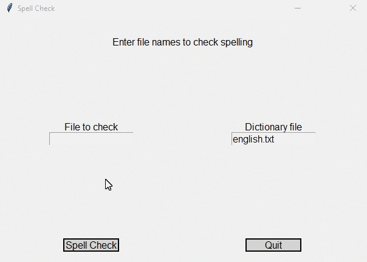

# Final Project 01
> GUI spellchecker for [my1stDraft.txt](my1stDraft.txt) and [myFinalDraft.txt](myFinalDraft.txt) files using binary search

## Screenshot

## Instructions
> Automated spell checkers are used to analyze documents and locate words  
> that might be misspelled.  These programs work by comparing each word in  
> the document to a large dictionary (non-Python sense) of words.  If the  
> word is not found in the dictionary, it is flagged as potentially incorrect.  
> 
> Write a GUI program that has 2 text boxes.  The first text box accepts a  
> file ([my1stDraft.txt](my1stDraft.txt), [myFinalDraft.txt](myFinalDraft.txt)) to check the spelling.  The second  
> file is the dictionary file or words ([english.txt](english.txt)).  When you click the spell-check  
> button the program opens both files reads the dictionary file into memory and  
> then spell checks the other file.  To do the spell checking of the other  
> file you should do a binary search on the list of words in the dictionary.  
> If the word is not in the dictionary file, print it on the screen as a  
> potentially incorrect word.