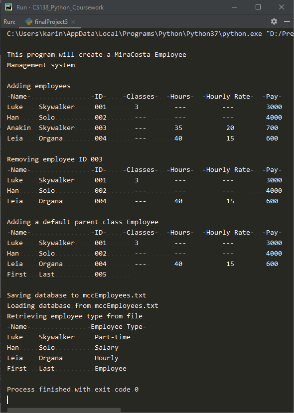

# Final Project 3
> Create MiraCosta Employee Management system using inheritance and polymorphism

## Screenshot

## Instructions
> You are creating a new Mira Costa Employee Management system.  There are 3  
> types of employees: Parttime Faculty, Salary(include fulltime Faculty),  
> and Hourly.  You need to create a generic employee which holds the employees  
> first and last name, and their id.  The parttime faculty member is paid a set  
> amount(say 1000 per class) for each class they teach.  The salary employee is  
> paid a monthly salary and the hourly employee is paid based on the number of  
> hours work multiplied by their hourly rate.  
> 
> The management system should allow you to:  
> - enter a new employee,  
> - remove an existing employee,  
> - save the existing employee database to a file ([mccEmployees.txt](mccEmployees.txt)),  
> - load an existing employee database file, and  
> - calculate the monthly paychecks for each employee.  
> 
> You should use inheritance and polymorphism which is discussed on page 419.