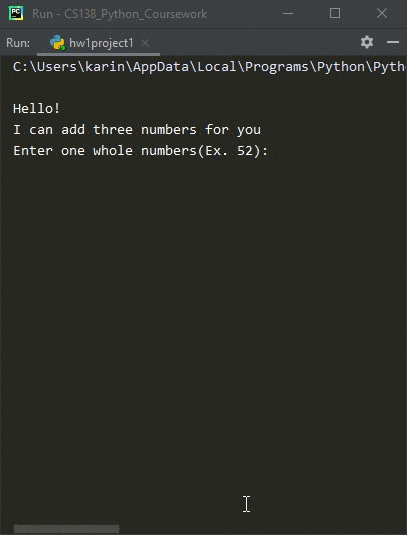

# Homework 01 Project 01
> Calculate sum & multiplication of 3 numbers

## Screenshot

## Instructions
> 1. Run the file [MyFirstProgram.py](MyFirstProgram.py). Review the code and  
> make sure you understand what is being accomplished.  
> 2. Modify the MyFirstProgram.py to get the input on separate lines.  
> 3. Modify the MyFirstProgram.py file so that it adds three numbers instead  
> of two. Store the sum of the three numbers in a variable. Run the program  
> so that it has no errors.  
> 4. Modify the MyFirstProgram.py file so that it also multiplies the same  
> three numbers and stores the result in a variable.  
> 5. Test your program. Do not use the same number 3 times nor the numbers  
> 1, 2 or 3 as input.