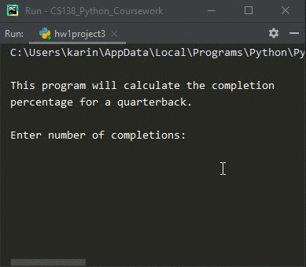

# Homework 01 Project 03
> Compute the completion percentage of a quarterback

## Screenshot

## Instructions
> Write a program that computes the completion percentage for a quarterback.  
> Your input will be pass completions and pass attempts.  For example if the  
> number of pass completions is 3 and the number of pass attempts is 5 the  
> completion percentage is 60%.