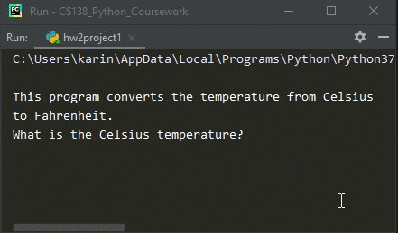

# Homework 02 Project 01
> Convert temperature from &deg;C to &deg;F

## Screenshot

## Instructions
> Programming Exercise #1, pg. 53  
> A user-friendly program should print an introduction that tells the user  
> what the program does.  Modify the convert.py program (Section 2.2) to  
> print an introduction.