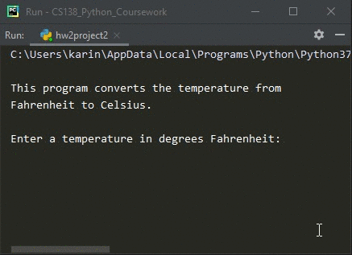

# Homework 02 Project 02
> Convert temperature from &deg;F to &deg;C

## Screenshot

## Instructions
> Write a program that converts degrees Fahrenheit to Celsius using the  
> following formula:  
> 
> degreesC = 5(degreesF – 32)/9  
> 
> Prompt the user to enter a temperature in degrees Fahrenheit, and then  
> let the program print out the equivalent Celsius temperature, including  
> the fractional part to at least one decimal point. If you have more than  
> one decimal point, don’t worry about it right now.  
> A possible dialog might be:  
> 
> Enter a temperature in degrees Fahrenheit:  72  
> 72 degrees Fahrenheit = 22.2 degrees Celsius