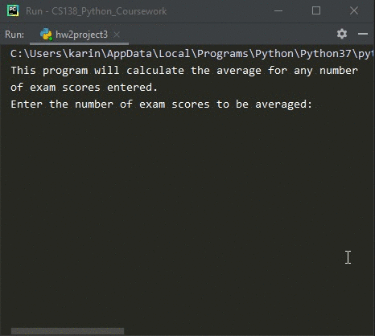

# Homework 02 Project 03
> Calculate average of exam scores entered

## Screenshot

## Instructions
>  Modify the avg2.py program (Section 2.5.3) to find the average of N  
>  (where N is any number) exam scores. Hint, you will need to use a loop  
>  for this.  Have the user enter the total number of scores that they will enter.  
>  Example:  
>  
>  Enter the number of exam scores to be averaged: 4  
>  Enter Exam Score 1: 80  
>  Enter Exam Score 2: 90  
>  Enter Exam Score 3: 95  
>  Enter Exam Score 4: 75  
>  
>  Average Exam Score: 85