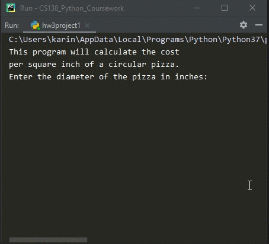

# Homework 03 Project 01
> Calculate cost per sq. in. of circular pizza

## Screenshot

## Instructions
> Write a program that calculates the cost per square inch of a circular pizza,  
> given its diameter and price.  The formula for area is A = πr2.  
> (#2, pg.76). 