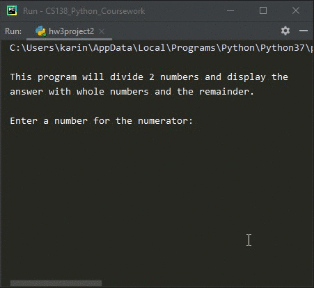

# Homework 03 Project 02
> Divide 2 numbers and display whole numbers with remainder

## Screenshot

## Instructions
> Write a program that divides two number and outputs the results using  
> whole numbers and the remainder.  
> Example:  
> If numerator is 8 and the denominator is 3,  
> the expected output would be 2R2.