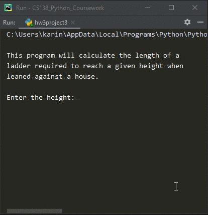

# Homework 03 Project 03
> Calculate length of ladder required to reach height of house

## Screenshot

## Instructions
> Write a program to determine the length of a ladder required to reach a  
> given height when leaned against a house.  The height and angle of the  
> ladder are given as inputs. To compute length use  
> length = height / sin (angle).  
> 
> Note: The angle must be in radians.  Prompt for an angle in degrees and  
> use this formula to convert:  
> radians = (π/ 180) degrees  
> 
> (#10, pg. 77)