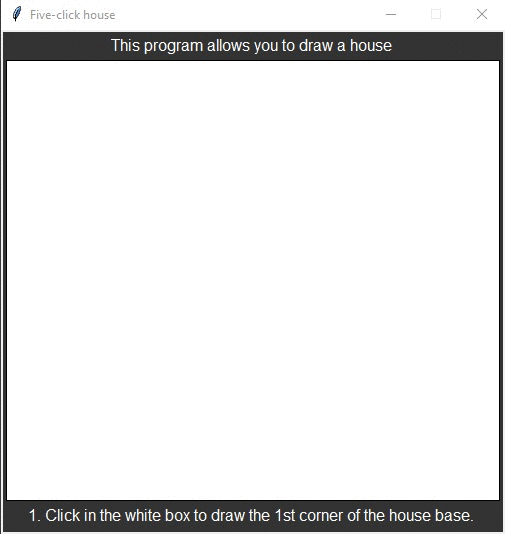

# Homework 04 Extra Credit
> GUI to draw a simple house using 5 mouse-clicks

## Screenshot

## Instructions
> You are to write a program that allows the user to draw a simple house  
> using five mouse-clicks.  The first two clicks will be the opposite  
> corners of the rectangular frame of the house.  The third click will  
> indicate the center of the top edge of a rectangulr door.  The door  
> should have a total width this is 1/5 of the width of the house frame.  
> The sides door should extend from the corners of the top down to the  
> bottom of the frame.  The fourth click will indicate the center of a  
> square window.  The windows is half as wide as the door.  The last click  
> will indicate the peak of the roof.  The edges of the roof will extend  
> from the point at the peak to the corners of the top edge of the house frame.  
> 
> (#11 pg. 120)