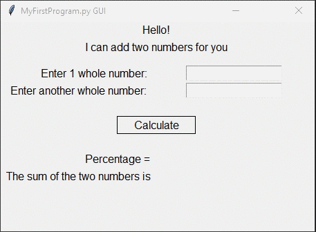

# Homework 04 Project 02
> GUI to calculate sum and percentage of 2 numbers

## Screenshot

## Instructions
> Create a simple GUI for MyFirstProgram.py using the techniques from the  
> chapter. Your GUI should include both the input of number and the output  
> of the answers.  