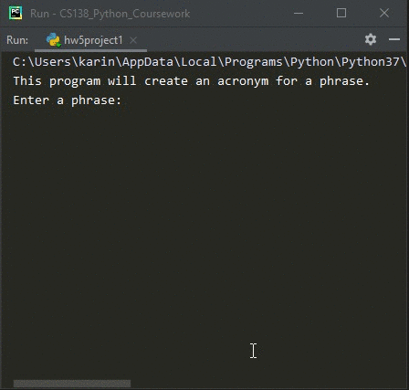

# Homework 05 Project 01
> Create an acronym for a phrase

## Screenshot

## Instructions
> An acronym is a word formed by taking the first letters of the words in a  
> phrase and making a word from them.  For example, RAM is an acronym for  
> "random access memory." Write a program that allows the user to type in a  
> phrase and then outputs the acronym for that phrase.  
> Note: the acronym should be all uppercase, even if the words in the phrase  
> are not capitalized. (#4, pg. 162)