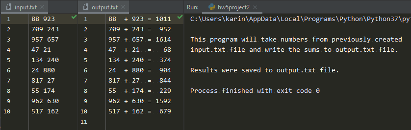

# Homework 05 Project 02
> Read numbers from [input.txt](input.txt) file, write sums to [output.txt](output.txt) file

## Screenshot

## Instructions
> 1. Create a file named [input.txt](input.txt). On each line of the file enter two numbers  
> separated by a space; add 20 numbers to the file; so there will be 10 lines  
> in the file.  
> 2. Write a program that open the file you just created and reads each line into  
> a list. Name this file [hw5project2.py](hw5project2.py).  
> Process each item of the list by converting the two number strings in list  
> to numbers and summing them together. Write this sum out to a file, [output.txt](output.txt).  
> The output file will have 10 lines as well.