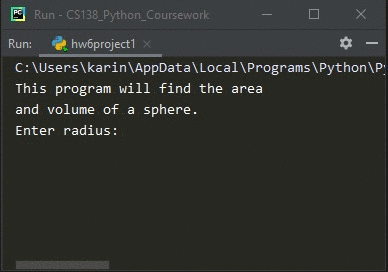

# Homework 06 Project 01
> Calculate the area and the volume of a sphere

## Screenshot
> **Output 1**

> **Output 2**

## Instructions
> Write definitions for these functions:  
> `sphereArea(radius)` Returns the surface area of a sphere having the given radius.  
> `sphereVolume(radius)` Returns the volume of a sphere having the given radius.  
> 
> (#3, pg. 197) Show the outputs of two different sphere radius'. 