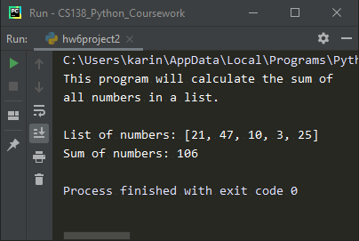

# Homework 06 Project 02
> Test a function `sumList(nums)`

## Screenshot

## Instructions
> Write and test a function to meet this specification.  
> `sumList(nums)` nums is a list of numbers.  Returns the sum of the numbers in the list.  
> 
> (#12, pg. 198)