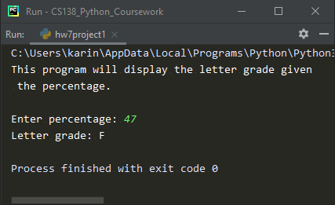

# Homework 07 Project 01
> Calculate letter grade given percentage

## Screenshot
> **Output 1**

> **Output 2**

> **Output 3**

> **Output 4**

> **Output 5**

## Instructions
> Write a program that calculates and prints your grade.  
> Input is the percentage of points that you received, the output is the  
> letter grade. 