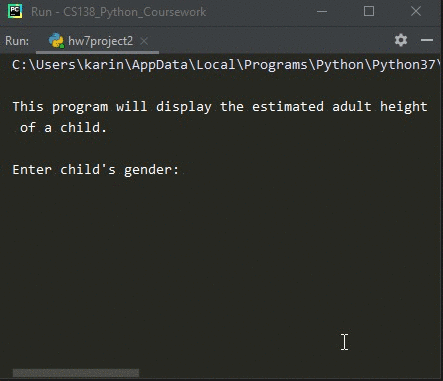
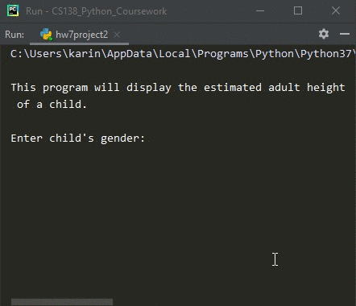

# Homework 07 Project 02
> Estimate the adult height of child

## Screenshot
> **Output 1**

> **Output 2**

## Instructions
>  One way to estimate the adult height of a child is to use the following  
>  formulas, which use the height of the parents:  
>  
>  %20%2B%20H_%7Bfather%7D%7D%7B2%7D)
>  <!-- Hmale-child = ((Hmother * 13/12) + Hfather ) / 2  -->
>  %20%2B%20H_%7Bmother%7D%7D%7B2%7D)
>  <!-- Hfemale-child = ((Hfather * 12/13) + Hmother ) / 2  -->  
>  
>  All height are in inches.  
>  
>  Write a program that takes as input the gender of the child, the height  
>  of the mother in inches and the height of the father in inches. Output the  
>  estimated adult height of the child in inches.  Convert this to feet, and  
>  inches, ex. 63 inches = 5 feet 3 inches.