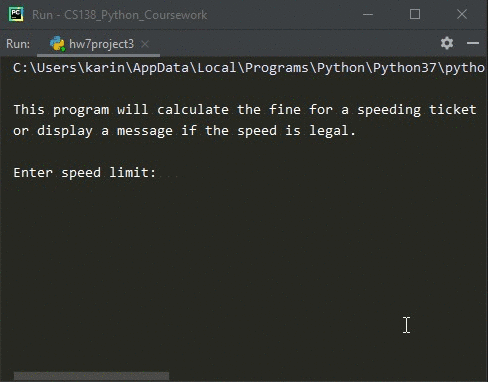
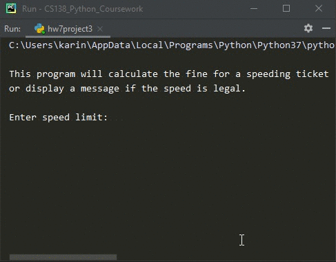
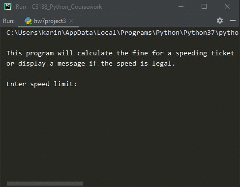

# Homework 07 Project 03
> Calculate speeding ticket fine

## Screenshot
> **Output 1**

> **Output 2**

> **Output 3**

## Instructions
> The speeding ticket fin policy in Poducksville is $50 plus $5 for each mph  
> over the limit plus a penalty of $200 for any speed over 90 mph.  Write a  
> program that accepts a speed limit and a clocked speed and either prints a  
> message indicating the speed was legal or prints the amount of the fine, if  
> the speed is illegal. (#6, pg. 230)