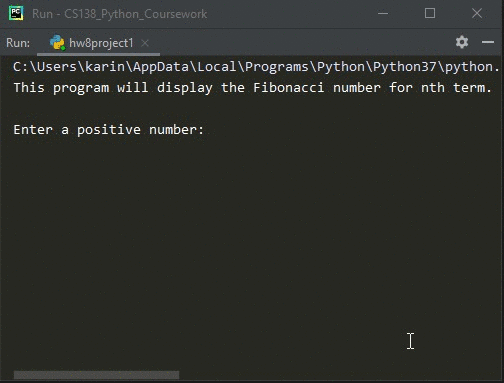

# Homework 08 Project 01
> Compute Fibonacci numbers using recursion

## Screenshot

## Instructions
> The Fibonacci sequence start 1,1,2,3,5,8... Each number in the sequence  
> (after the first two) is the sume of the previous two.  Write a program  
> that computes and outputs the nth Fibonacci number, where n is a value  
> entered by the user. ( #1, pg. 262)