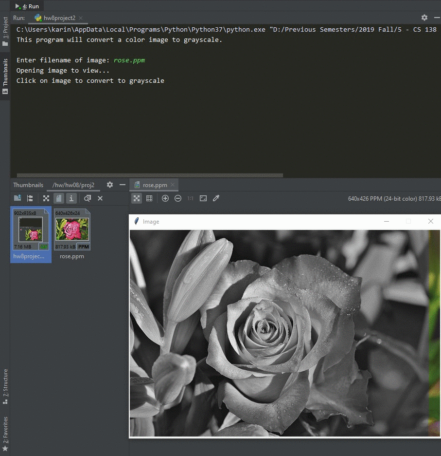

# Homework 08 Project 02
> GUI to transorm image to greyscale

## Screenshot
> **Start greyscale**

> **Save new greyscale image**
> 

## Instructions
> Write a program that converts a [color image](rose.ppm) to [grayscale](grey_rose.ppm).  The user supplies  
> the name of a file containing a GIF or PPM image, and the program loads the  
> image and displays the file. At the click of the mouse, the program converts  
> the image to grayscale.  The user is then prompted for a filename to store  
> the grayscale image in.  
> 
> You will probably want to go back and review the Image object from the  
> graphics library (section 4.8.4). The basic idea for converting the image  
> is to go pixel by pixel and convert each one from color to an appropriate  
> shade of gray.  A gray pixel can be create by setting its red, green, and  
> blue components to have the same brightness.  So, color_rgb(0,0,0) is black,  
> color_rgb(255,255,255) is white, and color_rgb(127,127,127) is a gray  
> "halfway" between.  You should use a weighted average of the original RGB  
> values to determine the brightness of the gray.  The pseudocod for the  
> grayscale can be found in the book on pg. 265. (#14, pg. 265)