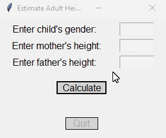

# Homework 09 Project 01
> GUI for [hw7project2.py](../../hw07/proj2/hw7project2.py) to estimate height of child

## Screenshot

## Instructions
> Use the [Button class](../../../button.py) to create GUI for [hw07proj2](../../hw07/proj2/hw7project2.py)