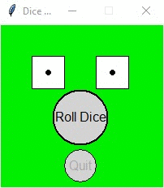

# Homework 09 Project 02
> GUI with modified circular button, [cbutton.py](../../../cbutton.py)

## Screenshot

## Instructions
> Programming Exercise #7, pg. 335.
> 
> This program will use a modified Button class that creates circular buttons  
> called [CButton](../../../cbutton.py). The class will implement the exact same methods that are  
> in the Button class. The constructor takes the center of the button and its  
> radius as normal parameters. Tested using roller.py.