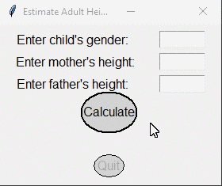

# Homework 09 Project 03
> GUI for [hw9project1.py](../proj1/hw9project1.py) with modified [cbutton.py](../../../cbutton.py)

## Screenshot

## Instructions
> Use your new [Circular Buttons](../../../cbutton.py) to modify [Project 1](../proj1/hw9project1.py).