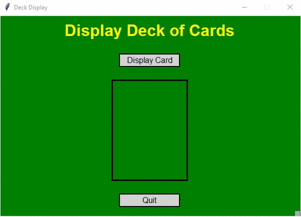

# Homework 10 Extra Credit
> GUI for displaying all cards in a deck

## Screenshot

## Instructions
> Modify the [program above](../proj2/hw10project2.py) to show a complete deck of cards ie suit and  
> card 2-10, Jack, Queen, King and Ace. (Keep the drawing simple) 