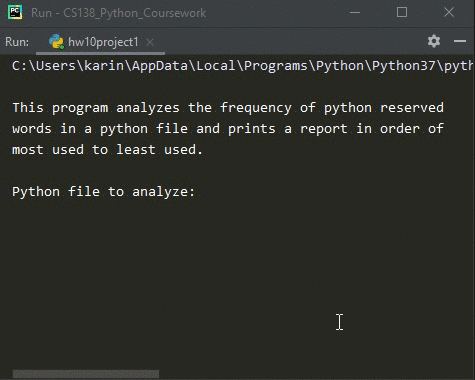

# Homework 10 Project 01
> Counts [reserved](reserved.txt) words python file

## Screenshot

## Instructions
> Create a program that counts the reserved words in a python file. Use the  
> reserved word list found on page 469 of your textbook.