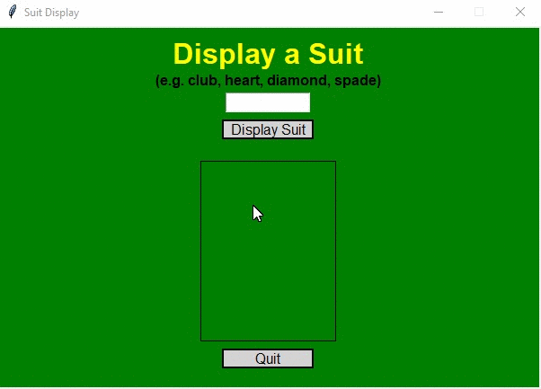

# Homework 10 Project 02
> GUI for suit of card using dictionary

## Screenshot

## Instructions
> Create a GUI with a text box, button and a picture. The user will type in  
> the suit of a card (spade, clubs, hearts, diamond) and it will show the  
> corresponding suit.  Use a dictionary as the storage mechanism. 