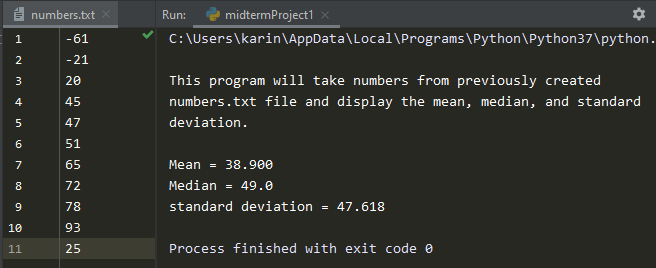

# Midterm Project 01
> Calculate mean, median and standard deviation  
> from [numbers.txt](numbers.txt) file

## Screenshot

## Instructions
> Write a program that finds the mean, median, and standard deviation of a  
> list of numbers which you read from a file.  1 number per line and should  
> support both positive and negative number.  
> 
> Mean is defined as the sum of all the given elements divided by the total  
> number of elements.  
> 
> Median is defined as the middle number (in a sorted list of numbers).  
> 
> Standard deviation is a statistical measure of spread or variability.  
> The standard deviation is the root mean square (RMS) deviation of the  
> values from their arithmetic mean.  
> 
> List the 2 standard deviation range.  
> 
> Handle any errors that may occur with lists that vary in size from 0 to 1000.  
> 
> **Standard Deviation**
> LaTeX: S=\sqrt{\sum\left(X-M\right)^2\div\left(n\:-\:1\right)}S = ∑ ( X − M ) 2 ÷ ( n − 1 )  
>   where Σ = Sum of  
>   X = Individual score  
>   M = Mean of all scores  
>   n = Sample size (Number of scores)