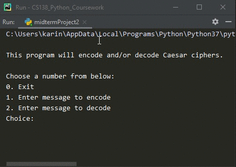

# Midterm Project 02
> Encode and decode Caesar ciphers

## Screenshot

## Instructions
> A Caesar cipher is a simple substitution cipher based on the idea of  
> shifting each letter of the plaintext message a fixed number (called the  
> key) of positions in the alphabet.  For example, if the key value is 2,  
> the word “Sourpuss” would be encoded as “Uqwtrwuu”.  Write a program that  
> can encode and decode Caesar ciphers.  You will also need to deal with  
> letters dropping off the end of the alphabet.  For example z with a key  
> of 2 would be b.  Here is the simple equation ord(ch) + key, this does  
> not handle drop off.  Hint: you make want to make a conversion list to  
> handle the drop off or use the modulus operator.  For more information  
> see your book pg. 163.  #7 & 8.