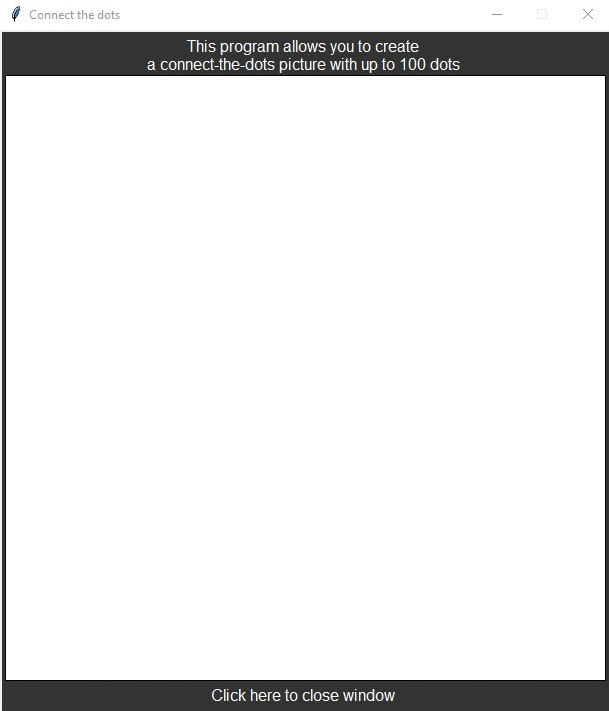

# Midterm Project 03
> GUI for connect the dots picture

## Screenshot

## Instructions
> You need to create a program that allows you to create a connect-the-dot  
> picture.  
> 
> Requirements:  
> - Create a connect the dot picture.  
>     + Your program should accept up to 100 mouse clicks.  
>     + Label each point with the appropriate number (the sequence number)  
>       1 for the first, 2 for the second and so forth.  
> - Must support a canvas of at least 600 x 600 pixels.